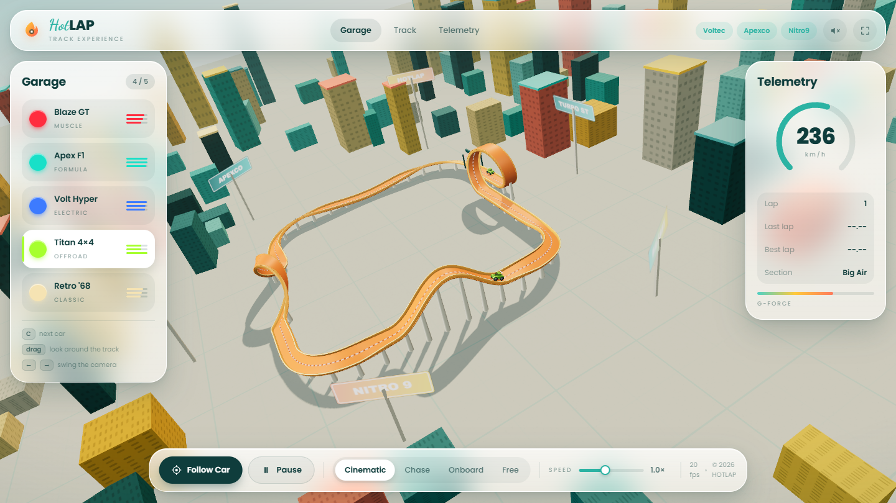
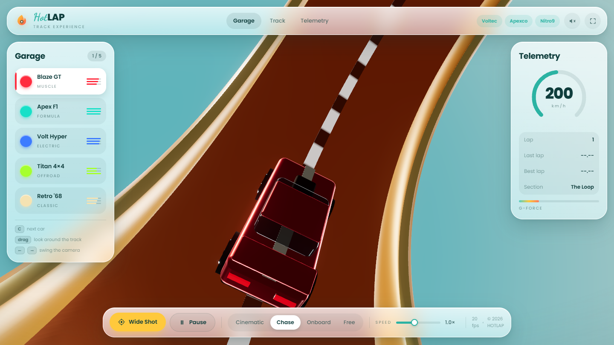
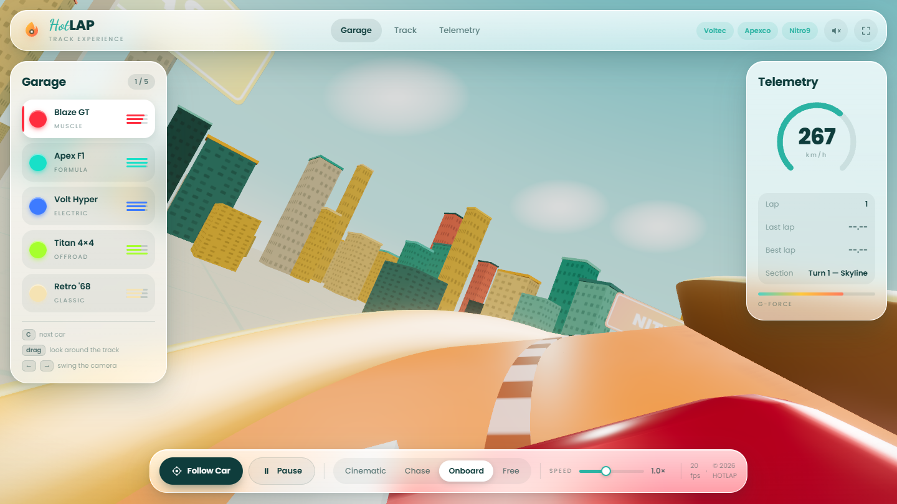

<div align="center">

# HOTLAP — Hot Wheels Game Concept

**Interactive 3D track experience · three.js · flat-illustration UI**
A die-cast orange circuit with a vertical loop, corkscrew and jump ramp, running through a bright toy city.
Deep teal ink, cream surfaces, script-and-caps typography.

[](https://kymy07.github.io/HotWheel_Game_Concept_Website/)
[](../../actions)
[]()

### 🔗 **[kymy07.github.io/HotWheel_Game_Concept_Website](https://kymy07.github.io/HotWheel_Game_Concept_Website/)**



</div>

---

## Overview

A concept website built around one idea: the track *is* the page. A Hot Wheels style
circuit plays on a loop in the background like an ambient animation, and the interface
floats above it in translucent glass panels — header, garage, telemetry, footer dock.

Everything on screen is **generated in code**. There are no 3D model files, no textures
on disk and no video. The circuit, the five cars, the city skyline and the
billboards are all built at runtime from geometry primitives, so the whole site is under
100 KB excluding the three.js runtime pulled from CDN.

---

## Features

| | |
|---|---|
| 🛣️ **Procedural circuit** | Straights, banked turns, a jump ramp, a leaning vertical loop and a corkscrew — assembled by a `PathBuilder` that closes exactly on itself |
| 🔄 **Loop & corkscrew** | The car rolls fully upside down through the loop and barrel-rolls through the corkscrew, driven by analytic up vectors rather than parallel transport |
| 🚗 **Five cars** | Blaze GT, Apex F1, Volt Hyper, Titan 4×4, Retro '68 — each modelled from code with its own silhouette, and stats that actually feed the driving model |
| 🎥 **Four cameras** | Cinematic fly-around, chase cam that trails *along the curve*, hood cam, and free orbit — grab the scene at any time to look around |
| 🏙️ **Toy city** | 190 candy-coloured towers, double-sided billboards, drifting clouds and a bright gradient sky — all instanced into 5 draw calls |
| 🎨 **Flat-illustration UI** | Deep teal ink on frosted cream cards, one bright yellow accent, pill buttons — Dancing Script paired with heavy Poppins caps |
| 📊 **Live telemetry** | Speedometer, lap counter, lap and best-lap times, current track section, G-force meter |
| 🔊 **Synth engine note** | Web Audio oscillators pitched to the car's speed, off by default |
| ✨ **4× MSAA** | The composer renders into a multisampled target, so edges stay clean — `antialias: true` on the renderer does nothing once post-processing is on |
| ⚡ **Adaptive quality** | Frame rate is sampled continuously; resolution and bloom step down automatically if the GPU falls behind |
| 📱 **Responsive** | Panels reflow down to mobile; every animation stops under `prefers-reduced-motion` |

---

## The Circuit

One closed lap, 585 units long, divided into named sections that the telemetry panel
reports as the car passes through them.

| Section | What happens |
|---|---|
| **Start / Finish** | Flat straight under the gantry |
| **The Loop** | Full vertical loop-the-loop; it drifts sideways as it goes round so the climb and the descent pass beside each other |
| **Turn 1 — Skyline** | Banked right-hander climbing 6 units |
| **Big Air** | Elevated jump ramp over the rooftops |
| **Turn 2 — Downtown** | Banked descent back to street level |
| **Corkscrew** | 360° barrel roll along the back section |
| **Turn 3 — The Sweeper** | Banked sweeper past the billboards |
| **Back Straight** | Dipped run home |
| **Turn 4 — Final** | Last corner onto the start line |

---

## The Garage

Stats are not decoration — top speed, acceleration and grip feed straight into the
speed-target model, so the Titan really does crawl uphill and the Apex really does
carry more speed through the corners.

| Car | Class | Top Speed | Acceleration | Grip |
|---|---|:---:|:---:|:---:|
| **Blaze GT** | Muscle | 0.86 | 0.78 | 0.72 |
| **Apex F1** | Formula | 1.00 | 1.00 | 0.95 |
| **Volt Hyper** | Electric | 0.96 | 0.92 | 0.88 |
| **Titan 4×4** | Offroad | 0.72 | 0.70 | 1.00 |
| **Retro '68** | Classic | 0.78 | 0.74 | 0.68 |

---

## Controls

| Input | Action |
|---|---|
| **Follow Car** / `F` | Zoom in and chase the car around the track — press again for the wide shot |
| `1` `2` `3` `4` | Cinematic · Chase · Onboard · Free camera |
| **Garage panel** / `C` | Switch between the five cars |
| **Speed slider** | 0.35× – 2.0× simulation speed |
| `Space` | Pause / resume |
| Drag + scroll | Look around the track from any camera — grabbing the scene hands control over |
| `←` `→` or `A` `D` | Swing the camera around the circuit |
| 🔊 / ⛶ | Engine sound · fullscreen |

---

## Tech Stack

**Frontend** — HTML5 · CSS3 (custom properties, grid, flexbox, `backdrop-filter`) · vanilla JavaScript (ES modules)
**Type** — Poppins (300–800) · Dancing Script (600–700)
**Graphics** — three.js r160 · WebGL 2 · custom GLSL skydome · instanced rendering · UnrealBloom post-processing
**Geometry** — CatmullRom curves · custom profile extrusion · procedural canvas textures
**Audio** — Web Audio API oscillators
**Fonts** — Inter · Orbitron (Google Fonts)
**Hosting** — GitHub Pages via GitHub Actions

No bundler and no framework. three.js loads from CDN through an import map; `npm` is
only used for the headless test suite.

---

## Project Structure

```
HotWheel_Game_Concept_Website/
├── index.html                 # page shell + glass UI markup
├── start.bat                  # one-click local server (Windows)
├── css/
│   └── style.css              # design system: glass, blur, layout, responsive
├── js/
│   ├── app.js                 # scene, driving model, cameras, UI, audio
│   ├── track.js               # PathBuilder → closed circuit, frames, track mesh
│   ├── cars.js                # five procedural car models
│   └── city.js                # skydome, ground, instanced skyline, billboards
├── tests/
│   └── geometry.test.mjs      # headless checks on the generated geometry
├── docs/screenshots/          # images used in this README
├── .github/workflows/
│   └── deploy.yml             # verify → deploy to GitHub Pages
└── package.json               # dev-only: three.js for the tests
```

---

## Getting Started

```bash
git clone https://github.com/kymy07/HotWheel_Game_Concept_Website.git
cd HotWheel_Game_Concept_Website
python -m http.server 8000
```

Then open <http://localhost:8000/>. On Windows you can just double-click `start.bat`.

> **Serve over HTTP, not `file://`.** The site is split into ES modules, and browsers
> refuse to load those from the filesystem. An internet connection is needed on first
> load for three.js and the fonts.

---

## Testing

The circuit and the cars are pure maths, so they are verified without a browser or a GPU.

```bash
npm install
npm test
```

12 checks: circuit closure, finite coordinates, no duplicate control points, ground
clearance, frame orthonormality, seam continuity, roll smoothness, inversion ratio,
self-intersection clearance, section-marker ordering, and that every car builds with its
wheels exactly on the road.

---

## Deployment

Every push to `main` runs [`.github/workflows/deploy.yml`](.github/workflows/deploy.yml):

```
push to main → verify (npm test) → upload artifact → deploy to GitHub Pages
```

The deploy job only runs if the geometry tests pass.

```bash
git add -A
git commit -m "your message"
git push origin main
```

> **First-time setup** — go to **Settings → Pages → Build and deployment → Source**
> and select **GitHub Actions**. The workflow takes over from there.

---

## Editing Guide

<details>
<summary><b>Redrawing the circuit</b></summary>

The layout lives in `buildCircuit()` at the bottom of `js/track.js`. A virtual pen walks
through the world, one primitive at a time:

```js
const pb = new PathBuilder(-47, 5, -61, 0);   // x, y, z, heading
pb.straight(30)
  .loop(12, 16)          // radius 12, leaning 16 units forward
  .straight(48)
  .turn(90, 26, 6)       // 90° right, radius 26, climbing 6
  .hill(50, 15)          // jump ramp: length 50, height 15
  .corkscrew(50, 9, 1);  // length 50, radius 9, one full roll
```

**Keep it closed.** The course is a rounded rectangle: four 90° turns of equal radius,
with opposite straights of equal total length. Loops, hills and corkscrews return to the
same heading and elevation, so they can be dropped in anywhere. Elevation changes must
also cancel out — `turn(90, 26, 6)` has to be matched by a `-6` somewhere.

`pb.mark('Name')` labels the section that follows it for the telemetry panel.

</details>

<details>
<summary><b>Adding a car</b></summary>

Append an entry to the `CARS` array in `js/cars.js`. The builder reads it and assembles
the model — no 3D file needed.

```js
{
  id: 'nova', name: 'Nova RS', klass: 'Concept',
  color: 0xff00aa, accent: 0x2a0018, glass: 0x0d1b2a,
  speed: 0.9, accel: 0.85, grip: 0.8,          // all 0..1, they drive the physics
  body:   { len: 4.6, wid: 2.0, hgt: 0.9, ride: 0.5 },
  cabin:  { len: 2.0, wid: 1.6, hgt: 0.6, z: -0.2 },
  wheel:  { r: 0.55, w: 0.4, fz: 1.5, bz: -1.45, x: 0.94 },
  spoiler: 'wing',      // 'wing' | 'ducktail' | 'rollbar' | 'none'
  scoop: true, stripe: 0xffffff,
}
```

Optional flags: `openWheel` (formula cockpit and exposed wheels), `nose` (pointed nose
cone and front wing), `glow` (underglow colour). The garage panel, the keyboard `C`
shortcut and the accent colour all pick it up automatically.

</details>

<details>
<summary><b>Tuning the look</b></summary>

- **Colours and type** — every value is a CSS custom property in the `:root` block at
  the top of `css/style.css`: `--ink` (deep teal), `--cream`, `--teal`, `--yellow`,
  `--coral`, plus `--font` and `--script`. Change them there and the whole UI follows.
- **Track colours** — `buildTrackMesh()` in `js/track.js`: `bedMat` is the orange deck,
  `railMat` the side rails, `glowMat` the glowing edge strips.
- **Daylight** — the hemisphere, key and fill lights in `init()` in `js/app.js`, plus
  `renderer.toneMappingExposure` and the `FogExp2` density.
- **City colours** — the `PALETTE` array at the top of `js/city.js` tints every tower.
- **Bloom** — the `UnrealBloomPass` arguments are strength, radius and threshold. Raise
  the threshold if bright surfaces start blowing out.
- **City density** — `makeCity(points, { count, inner, spread })` in `js/app.js`.
  `inner` keeps the skyline clear of the cinematic camera's orbit.

</details>

<details>
<summary><b>How the car stays glued to the track</b></summary>

Sliding a car along a 3D curve needs an *up* vector at every point. The textbook answer
is **parallel transport** (rotation-minimising frames), and it looks right for straights,
hills and loops.

It fails on a corkscrew. Transporting a frame around a helix leaves a holonomy residue
that never closes — measured here at **~110° of phantom roll per lap**, which slowly
barrel-rolls the whole track and left 36% of the circuit inverted.

So the up vector is recorded *analytically* while each primitive is drawn:

| Primitive | Up vector |
|---|---|
| Straight, turn, hill | World up |
| Loop | Toward the loop centre — `up·cos φ − forward·sin φ` |
| Corkscrew | Toward the helix axis — `up·cos φ − right·sin φ` |

Frames are sampled by **arc length**, so `u` is mapped back to the control-point index
through the curve's own length table. The seam now closes to **0.47°**, and only the loop
and corkscrew invert the car.

The loop needs a third trick. Leaning it forward does not stop the climbing and
descending halves from cutting through each other — for the two branches at equal height
the gap is `24·sin φ − len·(1 − φ/π)`, which crosses zero for every lean between 0 and 48.
So the loop drifts **sideways** instead, eased in and out so the entry tangent stays
straight; the two halves now pass 10.9 units apart, and a test asserts it.

Two related details: jump ramps use a **raised cosine** rather than a half sine, because
a half sine leaves the ground at a 43° crease (worst per-sample roll dropped from 11.7°
to 2.4°); and the chase camera **trails along the curve** instead of sitting on a
straight line behind the car, which would otherwise punch through the track inside
the loop.

</details>

<details>
<summary><b>More screenshots</b></summary>



*Chase camera trailing the Blaze GT down the main straight.*



*Hood cam banking through Turn 1, city skyline tilting with the track.*

</details>

---

## Browser Support

Requires WebGL 2 and `backdrop-filter`.

| Browser | Supported |
|---|:---:|
| Chrome / Edge 90+ | ✅ |
| Firefox 88+ | ✅ |
| Safari 15.4+ | ✅ |
| Mobile Chrome / Safari | ✅ (reduced layout) |

---

## Roadmap

- [ ] Keyboard driving — take manual control of the car
- [ ] Track editor: compose a circuit from the primitives in the browser
- [ ] Ghost laps and a persistent best-lap board
- [ ] Paint customisation per car
- [ ] Time-of-day cycle

---

## Contact

[](mailto:adlishah0821@gmail.com)
[](https://www.linkedin.com/in/adlishah-hakimi-56325223a/)
[](https://github.com/kymy07)

---

<div align="center">

**Adlishah Hakimi bin Sharilfuddin** · Malaysia
Built with [three.js](https://threejs.org/) · No build step · No assets

</div>
